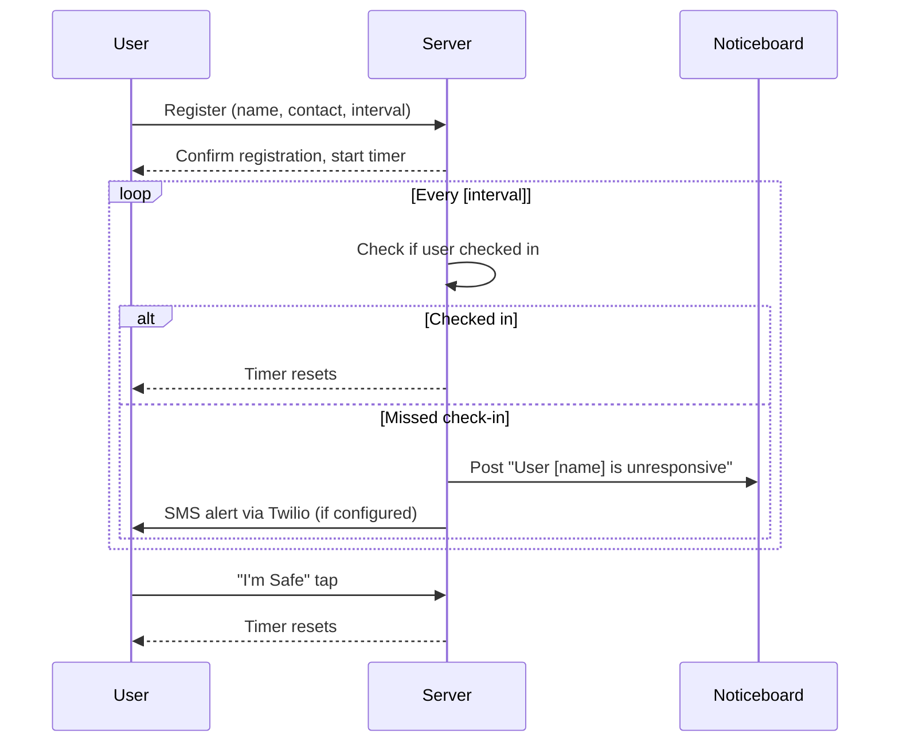
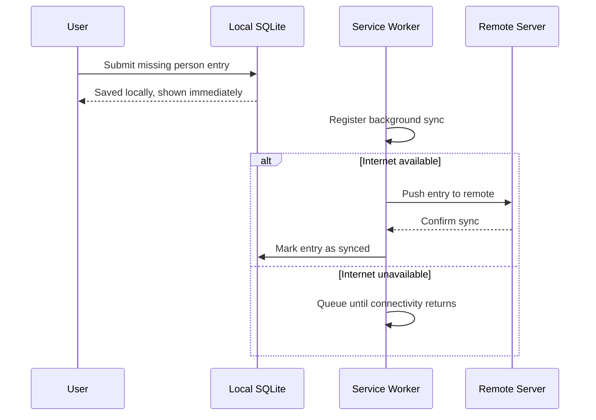

# SPEC.md — Mukto Mesh
### Single Source of Truth · July Hackathon 2026

---

## Table of Contents

1. [Project Overview and Vision](#1-project-overview-and-vision)
2. [Goals and Non-Goals](#2-goals-and-non-goals)
3. [Problem Statement](#3-problem-statement)
4. [Target Users and Use Cases](#4-target-users-and-use-cases)
5. [Functional Requirements](#5-functional-requirements)
6. [Non-Functional Requirements](#6-non-functional-requirements)
7. [Complete Feature List with Detailed Behaviour](#7-complete-feature-list-with-detailed-behaviour)
8. [User Flows and Application Workflow](#8-user-flows-and-application-workflow)
9. [System Architecture](#9-system-architecture)
10. [Technology Stack](#10-technology-stack)
11. [Database Schema and Data Models](#11-database-schema-and-data-models)
12. [API Design and Endpoints](#12-api-design-and-endpoints)
13. [Folder and Project Structure](#13-folder-and-project-structure)
14. [Coding Standards and Architectural Principles](#14-coding-standards-and-architectural-principles)
15. [Configuration and Environment Variables](#15-configuration-and-environment-variables)
16. [Error Handling Strategy](#16-error-handling-strategy)
17. [Authentication and Authorisation](#17-authentication-and-authorisation)
18. [State Management Approach](#18-state-management-approach)
19. [UI/UX Guidelines and Design Principles](#19-uiux-guidelines-and-design-principles)
20. [Performance Considerations](#20-performance-considerations)
21. [Security Considerations](#21-security-considerations)
22. [Logging and Monitoring](#22-logging-and-monitoring)
23. [Testing Strategy](#23-testing-strategy)
24. [Deployment Strategy](#24-deployment-strategy)
25. [Development Roadmap and Milestones](#25-development-roadmap-and-milestones)
26. [Future Enhancements](#26-future-enhancements)
27. [Assumptions, Constraints, and Trade-offs](#27-assumptions-constraints-and-trade-offs)
28. [Reference Repositories](#28-reference-repositories)
29. [To Be Decided (TBD)](#29-to-be-decided-tbd)

---

## 1. Project Overview and Vision

**Project Name:** Mukto Mesh

**Tagline:** *Stay connected when they cut the cord.*

**Hackathon:** July Hackathon 2026 — Track A: Crisis Tech

**Track justification:** Mukto Mesh is directly dedicated to the spirit of Jogajog — the decentralised communication network students used during the internet shutdowns of the July 2024 Revolution. It addresses what happens when infrastructure fails and communities need to function without it.

**Vision:** Mukto Mesh is a lightweight, offline-first, self-hostable community hub that any person in Bangladesh can download once and spin up on a laptop, instantly turning their local network into a functioning crisis coordination node — with chat, alerts, a knowledge base, missing person registry, safe check-in, and offline maps. No cloud dependency. No technical expertise required beyond running one command.

**Distribution model:** Dual-mode.
- **Online:** Deployed on Railway (backend) and Vercel (frontend), accessible to anyone with internet.
- **Offline node:** Downloaded from GitHub Releases, run locally via `npm start`, serves the entire neighbourhood over a shared WiFi hotspot. The browser is the client — no installation required on any other device.

---

## 2. Goals and Non-Goals

### Goals

- Build a fully functional offline-first PWA that works on any modern phone browser via local network
- Provide real-time LAN chat without requiring internet
- Serve a preloaded, Bangladesh-specific knowledge base in Bangla and English
- Enable missing person registration and search, with sync when internet returns
- Implement a safe check-in system that auto-flags unresponsive users
- Serve offline Bangladesh maps via ProtoMaps PMTiles
- Cache verified news from trusted Bangladeshi sources for offline reading
- Be distributable as a single downloadable package from GitHub
- Ship a complete, polished submission before July 30 23:59 BST

### Non-Goals

- This is not a nationwide real-time communication platform — it is hyper-local by design
- This does not replace mobile networks, satellite internet, or VPNs
- This does not include AI/LLM features (out of scope for 72h)
- This does not include Wikipedia or general survival guides (content is curated and Bangladesh-specific)
- This does not include hardware components
- This does not support P2P mesh networking across separate WiFi networks (future enhancement)

---

## 3. Problem Statement

In July 2024, the Bangladesh government shut down the internet for days. People couldn't find missing family members. Volunteers couldn't reach the injured. Nobody knew what was true. Rumors filled the gap that information left behind.

That wasn't bad luck. It was a deliberate cut, and ordinary people had nothing to fall back on.

VPNs need foresight. Satellite internet needs money. Most people in a crisis have neither. There's no tool built for this specific context, in Bangla, that an ordinary person can spin up on a laptop and use to keep their community functioning when the connection dies.

The next shutdown won't announce itself. And right now, nobody is ready.

---

## 4. Target Users and Use Cases

### Primary Users

| User | Context |
|---|---|
| Node operator | Downloads and runs Mukto Mesh on their laptop during or before a crisis. Becomes the hub for their building or neighbourhood. |
| Community member | Connects to the node via their phone browser on shared WiFi. No download required. |
| Node admin | Manages the noticeboard, pins critical alerts, broadcasts emergency messages. |

### Use Cases

- **During internet shutdown:** A student runs the node on their laptop. 30 neighbours connect via hotspot. They coordinate shelter, share first aid info, post alerts, check in regularly.
- **During protest:** A community runs the node to distribute verified information without relying on a central server that can be blocked.
- **Before a crisis:** Anyone downloads the package from GitHub while internet exists. They have everything they need when it's gone.
- **After a crisis:** Missing person reports and damage data sync automatically to the remote server when connectivity returns.

---

## 5. Functional Requirements

| ID | Requirement |
|---|---|
| FR-01 | The system shall provide real-time chat over LAN via WebSockets with no internet |
| FR-02 | The system shall provide a community noticeboard with tagged posts and pinning |
| FR-03 | The system shall serve a preloaded knowledge base in Bangla and English |
| FR-04 | The system shall allow users to register and search missing persons |
| FR-05 | The system shall implement a safe check-in system with auto-flagging on missed intervals |
| FR-06 | The system shall cache verified news from trusted Bangladeshi sources for offline reading |
| FR-07 | The system shall serve offline Bangladesh maps via ProtoMaps PMTiles |
| FR-08 | The system shall provide a node admin panel to manage posts, users, and broadcasts |
| FR-09 | The system shall function as an installable PWA on any mobile device |
| FR-10 | The system shall auto-sync queued offline data when internet is restored |
| FR-11 | The system shall be launchable with a single `npm start` command |
| FR-12 | The system shall be downloadable as a packaged release from GitHub |

---

## 6. Non-Functional Requirements

### Performance
- Initial page load under 2 seconds on a local network
- WebSocket message delivery under 100ms on LAN
- Knowledge base pages render instantly from cache — no network request required

### Offline Capability
- All core features must function with zero internet after first load
- Service worker must cache all static assets, knowledge base, and last-fetched news
- PWA must be installable on Android and iOS via browser prompt

### Scalability
- Designed for 5–100 concurrent users per node (neighbourhood scale)
- Not designed for national-scale simultaneous users on a single node

### Accessibility
- Bilingual UI: Bangla and English throughout
- WCAG AA colour contrast minimum
- Keyboard navigable
- Readable on low-resolution budget Android phones

### Security
- No surveillance tooling — the app explicitly does not track location or collect personal data beyond what users voluntarily submit
- Missing person entries and check-in contact numbers stored in SQLite, not transmitted without user action

### Reliability
- Graceful degradation: every feature must have a defined behaviour when internet is unavailable
- Node continues serving all features as long as the host laptop stays on

---

## 7. Complete Feature List with Detailed Behaviour

### 7.1 Local Network Chat

- Real-time messaging via WebSockets over LAN
- No account required — user enters a display name on first visit, stored in `localStorage`
- Channels: **General, Emergency, Coordination, Medical**
- Messages display sender name, channel, and timestamp
- Unread message badge per channel
- Emergency channel messages display with a red accent to indicate urgency
- No message persistence beyond the current session (messages are in-memory on the server) — **TBD: whether to persist to SQLite**
- Anyone connected to the node's IP on the same network can join instantly

### 7.2 Community Noticeboard

- Any connected user can post an alert
- Post types (tags): **Safety, Medical, Food/Water, Legal, News, General**
- Posts display author name, tag, timestamp, and content
- Admin can pin posts — pinned posts always appear at the top
- Admin can delete any post
- Posts stored in SQLite, persist across server restarts
- Real-time update via WebSocket push when new post is created

### 7.3 Knowledge Base (Preloaded, Static)

All content is bundled at build time. No network request required ever.

Sections:

| Section | Content |
|---|---|
| Your Rights | What police can and cannot do, right to assembly, what to do if arrested in Bangladesh |
| First Aid | Crowd crush, tear gas exposure, gunshot wounds, burns, basic triage |
| Emergency Contacts | Legal aid orgs, medical helplines, human rights bodies in Bangladesh |
| Crisis Checklist | 72-hour preparedness list, what to have before a shutdown |
| July 2024 — What We Learned | Factual, documented account of what happened and what worked |

- All sections available in Bangla and English with a language toggle
- Fully cached by service worker on first load
- Search within the knowledge base (client-side, no server required)

### 7.4 Safe Check-in System

- User registers: name + trusted contact phone number + check-in interval (2h, 4h, 6h, 12h)
- User must tap "I'm safe" within their chosen interval
- If interval is missed, user is flagged as **Unresponsive** on the noticeboard automatically
- Admin sees all registered check-in users and their current status on the admin panel
- Optional SMS alert to contact number via Twilio (configured via env var, mocked in demo if not configured)
- Check-in state persists in SQLite

### 7.5 Missing Person Registry

- Submit form: name, age, gender, last known location, description, contact person, contact number, optional photo upload
- Search by name or last known location
- Results displayed as cards with all submitted details
- Each entry has a status: **Missing, Found, Unverified**
- Admin can update status
- Entries stored in SQLite
- When internet returns, all entries auto-sync to the remote Railway server

### 7.6 Verified News Feed

- On startup (if internet available), backend fetches RSS feeds from curated trusted Bangladeshi sources:
  - Prothom Alo (RSS)
  - The Daily Star (RSS)
  - bdnews24 (RSS)
- Fetched articles stored in SQLite with full content, source, and timestamp
- Frontend reads from SQLite — works fully offline after first fetch
- Articles tagged by source, displayed in reverse chronological order
- Manual refresh button (only works when online)
- Last-fetched timestamp displayed so users know how stale the cache is

### 7.7 Offline Bangladesh Map

- Bangladesh `.pmtiles` extract served locally from the backend
- Frontend renders via MapLibre GL JS reading the local PMTiles file
- Users can drop pins on the map (missing person last location, shelter, danger zone)
- Pins saved to SQLite, visible to all connected users
- No external tile server required — fully offline
- Map source: OpenStreetMap via ProtoMaps basemaps

### 7.8 Node Admin Panel

- Accessible via `/admin` route, protected by a simple admin password set in env vars
- Features:
  - View all connected users (WebSocket connections)
  - View all check-in statuses
  - Pin / unpin / delete noticeboard posts
  - Broadcast an emergency message to all connected users (appears as a full-screen banner)
  - Update missing person entry status
  - View sync status (what's queued, what's synced)

### 7.9 Offline-First PWA

- vite-plugin-pwa with Workbox generates service worker automatically
- Caches: all static assets, all knowledge base pages, last-fetched news articles
- Installable on Android Chrome and iOS Safari via "Add to Home Screen"
- Works fully offline after first visit
- App manifest includes Mukto Mesh name, icon, and theme colour

### 7.10 Auto-Sync

- Background Sync API registration in service worker
- When connectivity is detected, queued missing person entries and map pins push to the remote Railway backend
- Sync status visible in admin panel
- Sync is one-directional: local → remote (the remote server is a backup, not the source of truth during offline operation)

---

## 8. User Flows and Application Workflow

### 8.1 Node Operator Flow

```
Download package from GitHub
        ↓
Run `npm start`
        ↓
App boots on localhost:3000
        ↓
Share local IP (e.g. 192.168.1.5:3000) with neighbours
        ↓
Neighbours open browser → type IP → instant access
        ↓
[Internet exists] → news feed fetches and caches
[Internet cut]   → everything still works from cache + SQLite
```

### 8.2 Community Member Flow

```
Connect to node operator's WiFi hotspot
        ↓
Open browser → type node IP:3000
        ↓
Enter display name
        ↓
Land on dashboard → access chat / noticeboard / knowledge base / map
        ↓
[Optional] Register for check-in
[Optional] Submit missing person report
```

### 8.3 Check-in Flow



### 8.4 Missing Person Sync Flow



---

## 9. System Architecture

```
┌─────────────────────────────────────────────────────┐
│                   CLIENT DEVICES                    │
│         (any phone/laptop on same WiFi)             │
│              React 19 PWA (Vite)                    │
│         Service Worker (Workbox) + Cache            │
└──────────────────────┬──────────────────────────────┘
                       │ HTTP + WebSocket (LAN)
┌──────────────────────▼──────────────────────────────┐
│               NODE OPERATOR'S LAPTOP                │
│                                                     │
│   Hono.js Server (Node.js 22 LTS)                  │
│   ├── REST API (noticeboard, missing persons,       │
│   │             check-in, news, map pins)           │
│   ├── WebSocket Server (chat, live updates)         │
│   ├── PMTiles Server (Bangladesh map tiles)         │
│   └── Static file server (built React app)         │
│                                                     │
│   SQLite (better-sqlite3)                           │
│   └── Single file: mukto_mesh.db                   │
└──────────────────────┬──────────────────────────────┘
                       │ HTTPS (when internet exists)
┌──────────────────────▼──────────────────────────────┐
│              REMOTE INFRASTRUCTURE                  │
│   Railway: Hono backend (sync endpoint only)        │
│   Vercel:  React PWA (online access)                │
│   GitHub:  Releases for download                    │
└─────────────────────────────────────────────────────┘
```

**Key architectural principle:** The remote infrastructure is optional. The entire system functions without it. Remote serves two purposes only: (1) online access for those who haven't downloaded the package, and (2) receiving synced data from local nodes when internet returns.

---

## 10. Technology Stack

### Frontend
| Layer | Choice | Reason |
|---|---|---|
| Framework | React 19 | Stable, widely supported |
| Build tool | Vite | Fast HMR, excellent PWA plugin |
| Language | TypeScript | Type safety throughout |
| Styling | Tailwind CSS | Utility-first, fast to build |
| Components | shadcn/ui | Accessible, unstyled by default, Tailwind-compatible |
| PWA | vite-plugin-pwa + Workbox | Zero-config service worker, offline caching |
| Maps | MapLibre GL JS + PMTiles JS | Offline tile rendering |
| State | Zustand | Lightweight, no boilerplate |
| Data fetching | TanStack Query (React Query) | Cache management, background sync awareness |
| WebSocket client | Native browser WebSocket API | No library needed |

### Backend
| Layer | Choice | Reason |
|---|---|---|
| Framework | Hono.js | TypeScript-first, built-in WebSocket, lightweight |
| Runtime | Node.js 22 LTS | Stable, widely supported |
| Language | TypeScript | Consistent with frontend |
| Database | SQLite via better-sqlite3 | Zero setup, single file, runs anywhere |
| RSS parsing | rss-parser (npm) | Lightweight, no dependencies |
| PMTiles serving | @protomaps/serve or static file serve | Serves .pmtiles locally |
| SMS | Twilio SDK (optional) | Check-in alerts, mocked in demo |

### Infrastructure
| Layer | Choice |
|---|---|
| Frontend hosting | Vercel (free tier) |
| Backend hosting | Railway (free tier) |
| Distribution | GitHub Releases (zip package) |
| Package manager | npm |

### Tooling
| Tool | Purpose |
|---|---|
| ESLint + Prettier | Linting and formatting |
| tsx | Run TypeScript directly in Node |
| concurrently | Run client and server together in dev |
| pkg or Bun (TBD) | Bundle into single executable for distribution |

---

## 11. Database Schema and Data Models

All tables live in a single SQLite file: `mukto_mesh.db`

### users
```sql
CREATE TABLE users (
  id TEXT PRIMARY KEY,           -- UUID
  display_name TEXT NOT NULL,
  created_at INTEGER NOT NULL    -- Unix timestamp
);
```

### messages
```sql
CREATE TABLE messages (
  id TEXT PRIMARY KEY,
  user_id TEXT NOT NULL,
  display_name TEXT NOT NULL,
  channel TEXT NOT NULL,         -- 'general' | 'emergency' | 'coordination' | 'medical'
  content TEXT NOT NULL,
  created_at INTEGER NOT NULL,
  FOREIGN KEY (user_id) REFERENCES users(id)
);
```
> **Note:** TBD whether messages persist or remain in-memory only. See Section 29.

### posts (noticeboard)
```sql
CREATE TABLE posts (
  id TEXT PRIMARY KEY,
  user_id TEXT NOT NULL,
  display_name TEXT NOT NULL,
  tag TEXT NOT NULL,             -- 'safety' | 'medical' | 'food' | 'legal' | 'news' | 'general'
  content TEXT NOT NULL,
  pinned INTEGER DEFAULT 0,      -- 0 | 1
  created_at INTEGER NOT NULL
);
```

### checkins
```sql
CREATE TABLE checkins (
  id TEXT PRIMARY KEY,
  display_name TEXT NOT NULL,
  contact_phone TEXT NOT NULL,
  interval_hours INTEGER NOT NULL,  -- 2 | 4 | 6 | 12
  last_checkin_at INTEGER NOT NULL,
  status TEXT DEFAULT 'active',     -- 'active' | 'unresponsive'
  created_at INTEGER NOT NULL
);
```

### missing_persons
```sql
CREATE TABLE missing_persons (
  id TEXT PRIMARY KEY,
  name TEXT NOT NULL,
  age INTEGER,
  gender TEXT,
  last_location TEXT NOT NULL,
  description TEXT,
  contact_name TEXT NOT NULL,
  contact_phone TEXT NOT NULL,
  photo_url TEXT,                -- local path or null
  status TEXT DEFAULT 'missing', -- 'missing' | 'found' | 'unverified'
  synced INTEGER DEFAULT 0,      -- 0 | 1
  created_at INTEGER NOT NULL
);
```

### news_articles
```sql
CREATE TABLE news_articles (
  id TEXT PRIMARY KEY,
  title TEXT NOT NULL,
  source TEXT NOT NULL,          -- 'prothomalo' | 'dailystar' | 'bdnews24'
  url TEXT NOT NULL UNIQUE,
  content TEXT,
  published_at INTEGER,
  fetched_at INTEGER NOT NULL
);
```

### map_pins
```sql
CREATE TABLE map_pins (
  id TEXT PRIMARY KEY,
  label TEXT NOT NULL,
  type TEXT NOT NULL,            -- 'shelter' | 'danger' | 'missing' | 'medical' | 'general'
  lat REAL NOT NULL,
  lng REAL NOT NULL,
  description TEXT,
  user_id TEXT,
  synced INTEGER DEFAULT 0,
  created_at INTEGER NOT NULL
);
```

---

## 12. API Design and Endpoints

Base URL (local): `http://[node-ip]:3000/api`
Base URL (remote): `https://[railway-url]/api`

### Noticeboard

| Method | Endpoint | Description |
|---|---|---|
| GET | `/posts` | Get all posts, pinned first |
| POST | `/posts` | Create a new post |
| PATCH | `/posts/:id/pin` | Toggle pin (admin only) |
| DELETE | `/posts/:id` | Delete post (admin only) |

### Missing Persons

| Method | Endpoint | Description |
|---|---|---|
| GET | `/missing` | Get all entries |
| POST | `/missing` | Submit new entry |
| PATCH | `/missing/:id/status` | Update status (admin only) |
| GET | `/missing/search?q=` | Search by name or location |

### Check-in

| Method | Endpoint | Description |
|---|---|---|
| POST | `/checkin/register` | Register for check-in |
| POST | `/checkin/ping` | "I'm Safe" action |
| GET | `/checkin/status` | Get all check-in statuses (admin) |

### News

| Method | Endpoint | Description |
|---|---|---|
| GET | `/news` | Get cached articles |
| POST | `/news/refresh` | Trigger RSS fetch (online only) |

### Map Pins

| Method | Endpoint | Description |
|---|---|---|
| GET | `/pins` | Get all pins |
| POST | `/pins` | Add a pin |
| DELETE | `/pins/:id` | Delete a pin (admin only) |

### Sync (remote server only)

| Method | Endpoint | Description |
|---|---|---|
| POST | `/sync/missing` | Bulk sync missing person entries |
| POST | `/sync/pins` | Bulk sync map pins |

### Admin

| Method | Endpoint | Description |
|---|---|---|
| POST | `/admin/broadcast` | Send emergency broadcast to all WS clients |
| GET | `/admin/connections` | Get active WebSocket connection count |

### WebSocket

| Event (client → server) | Payload | Description |
|---|---|---|
| `join` | `{ displayName, channel }` | Join a channel |
| `message` | `{ channel, content }` | Send a message |
| `switch_channel` | `{ channel }` | Switch active channel |

| Event (server → client) | Payload | Description |
|---|---|---|
| `message` | `{ id, displayName, channel, content, createdAt }` | New message |
| `post_created` | Post object | New noticeboard post |
| `post_pinned` | `{ id, pinned }` | Post pin toggled |
| `checkin_flagged` | `{ displayName }` | User flagged as unresponsive |
| `broadcast` | `{ message }` | Admin emergency broadcast |

---

## 13. Folder and Project Structure

```
mukto-mesh/
├── client/                          # React 19 + Vite frontend
│   ├── public/
│   │   ├── icons/                   # PWA icons
│   │   ├── bangladesh.pmtiles       # Bangladesh map tiles (committed to repo)
│   │   └── manifest.webmanifest
│   ├── src/
│   │   ├── components/
│   │   │   ├── ui/                  # shadcn/ui components
│   │   │   ├── Chat/
│   │   │   ├── Noticeboard/
│   │   │   ├── KnowledgeBase/
│   │   │   ├── CheckIn/
│   │   │   ├── MissingPersons/
│   │   │   ├── NewsFeed/
│   │   │   ├── Map/
│   │   │   └── Admin/
│   │   ├── pages/
│   │   │   ├── Dashboard.tsx
│   │   │   ├── Chat.tsx
│   │   │   ├── Noticeboard.tsx
│   │   │   ├── KnowledgeBase.tsx
│   │   │   ├── CheckIn.tsx
│   │   │   ├── MissingPersons.tsx
│   │   │   ├── News.tsx
│   │   │   ├── Map.tsx
│   │   │   └── Admin.tsx
│   │   ├── content/                 # Preloaded knowledge base content
│   │   │   ├── rights.bn.md
│   │   │   ├── rights.en.md
│   │   │   ├── firstaid.bn.md
│   │   │   ├── firstaid.en.md
│   │   │   ├── contacts.bn.md
│   │   │   ├── contacts.en.md
│   │   │   ├── checklist.bn.md
│   │   │   ├── checklist.en.md
│   │   │   ├── july2024.bn.md
│   │   │   └── july2024.en.md
│   │   ├── store/                   # Zustand stores
│   │   │   ├── useAuthStore.ts
│   │   │   ├── useChatStore.ts
│   │   │   └── useLanguageStore.ts
│   │   ├── hooks/
│   │   │   ├── useWebSocket.ts
│   │   │   └── useOfflineStatus.ts
│   │   ├── lib/
│   │   │   ├── api.ts               # Axios/fetch wrapper
│   │   │   └── sync.ts              # Background sync registration
│   │   ├── App.tsx
│   │   ├── main.tsx
│   │   └── sw.ts                    # Custom service worker additions
│   ├── vite.config.ts
│   ├── tailwind.config.ts
│   ├── tsconfig.json
│   └── package.json
│
├── server/                          # Hono.js backend
│   ├── src/
│   │   ├── db/
│   │   │   ├── schema.ts            # SQLite table definitions
│   │   │   └── index.ts             # DB connection singleton
│   │   ├── routes/
│   │   │   ├── posts.ts
│   │   │   ├── missing.ts
│   │   │   ├── checkin.ts
│   │   │   ├── news.ts
│   │   │   ├── pins.ts
│   │   │   ├── sync.ts
│   │   │   └── admin.ts
│   │   ├── ws/
│   │   │   └── chat.ts              # WebSocket handler
│   │   ├── jobs/
│   │   │   ├── checkinMonitor.ts    # Interval checker for missed check-ins
│   │   │   └── newsFetcher.ts       # RSS fetch job
│   │   ├── middleware/
│   │   │   └── adminAuth.ts         # Admin password check
│   │   └── index.ts                 # App entry point
│   ├── mukto_mesh.db                # SQLite file (gitignored)
│   ├── tsconfig.json
│   └── package.json
│
├── .env.example                     # Template for environment variables
├── .gitignore
├── package.json                     # Root package.json with concurrently scripts
├── README.md                        # Setup and run instructions
└── SPEC.md                          # This file
```

---

## 14. Coding Standards and Architectural Principles

- **TypeScript strict mode** enabled in both client and server `tsconfig.json`
- **No `any` types** — use `unknown` and narrow properly
- **File naming:** `PascalCase` for components, `camelCase` for utilities and hooks
- **Imports:** absolute imports via `@/` alias in both client and server
- **API responses:** always return `{ data, error }` shape — never throw raw errors to client
- **Database access:** all DB operations go through functions in `server/src/db/` — no raw SQL in route handlers
- **WebSocket events:** all event names are typed via a shared `WsEvent` enum
- **Commit discipline:** commit frequently with meaningful messages — judges review commit history
- **No squashing:** never squash commits at deadline
- **Open source licence:** MIT (as required by Track A guidelines)

---

## 15. Configuration and Environment Variables

Copy `.env.example` to `.env` in both `/client` and `/server`.

### Server (`server/.env`)

```env
PORT=3000
NODE_ENV=development

# Admin panel password
ADMIN_PASSWORD=changeme

# Twilio (optional — mock SMS if not set)
TWILIO_ACCOUNT_SID=
TWILIO_AUTH_TOKEN=
TWILIO_PHONE_NUMBER=

# Remote sync endpoint (Railway URL after deploy)
REMOTE_SYNC_URL=https://your-railway-app.railway.app

# Database path
DB_PATH=./mukto_mesh.db
```

### Client (`client/.env`)

```env
VITE_API_URL=http://localhost:3000
VITE_WS_URL=ws://localhost:3000/ws
```

> **Production override:** On Vercel, set `VITE_API_URL` to the Railway backend URL.

---

## 16. Error Handling Strategy

- All API responses use a consistent shape:
  ```ts
  { data: T | null, error: string | null }
  ```
- Frontend uses TanStack Query error boundaries to handle failed requests gracefully
- When offline, API calls fail silently and the UI shows a cached state with an "Offline" badge
- WebSocket disconnections trigger an automatic reconnection with exponential backoff (max 5 retries)
- SQLite errors are caught and logged server-side; a 500 response is returned with a generic error message (never expose DB internals)
- Missing person photo upload failures do not block the form submission — photo is optional

---

## 17. Authentication and Authorisation

**No user authentication.** Users enter a display name on first visit. This is stored in the browser's `localStorage`. There is no password, no account, no session token for regular users.

**Admin authorisation:**
- Admin panel at `/admin` is protected by a simple password check
- Password is set via `ADMIN_PASSWORD` env var
- On POST to `/api/admin/login`, server returns a short-lived JWT (24h expiry)
- JWT stored in `localStorage`, sent as `Authorization: Bearer` header on admin requests
- Admin middleware on Hono validates the JWT on every admin route

**Assumption:** For a 72h hackathon sprint, this is sufficient. A full RBAC system is a future enhancement.

---

## 18. State Management Approach

| State type | Solution |
|---|---|
| Server state (API data) | TanStack Query — handles caching, refetching, offline awareness |
| Global UI state (language, user name, admin status) | Zustand stores |
| WebSocket state (messages, active channel) | Zustand chat store, updated by `useWebSocket` hook |
| Form state | React `useState` — no form library needed at this scale |
| Offline/online status | `useOfflineStatus` hook wrapping `navigator.onLine` + event listeners |

---

## 19. UI/UX Guidelines and Design Principles

### Theme
- **Dark theme only** — optimised for night-time crisis use and low battery consumption on OLED screens
- **Colour palette:**
  - Background: `#0a0a0a`
  - Surface: `#141414`
  - Border: `#262626`
  - Primary accent: `#006A4E` (Bangladesh green)
  - Danger accent: `#C8102E` (Bangladesh red)
  - Text primary: `#f5f5f5`
  - Text muted: `#737373`
- **Typography:** System font stack — no web fonts to avoid network dependency
- **Border radius:** `0.375rem` (subtle, not rounded)

### Design Principles
- **Function over form** — every UI element serves a crisis use case
- **Large tap targets** — minimum 44px for all interactive elements (phone users in stress)
- **High contrast** — readability in poor lighting conditions
- **Language toggle** — prominent, always accessible from any page (Bangla | English)
- **Empty states** — every list has a meaningful empty state with a call to action
- **Error states** — specific, actionable, never generic "Something went wrong"
- **Offline badge** — a persistent banner when the node detects no internet, reassuring users that offline mode is intentional and everything still works

### Navigation
- Bottom navigation bar on mobile (5 items: Chat, Board, Info, People, Map)
- Sidebar on desktop
- Admin panel accessible via a lock icon in the corner, not in the main nav

---

## 20. Performance Considerations

- All knowledge base content is `.md` files compiled at build time — zero runtime fetch
- Bangladesh `.pmtiles` file is committed to the repo and served as a static asset — no tile API calls
- News articles cached in SQLite — news page loads instantly from DB even offline
- TanStack Query stale-while-revalidate — UI never blocks on a network request
- Service worker pre-caches all routes on install — navigation is instant
- WebSocket connections are pooled — the server handles up to ~100 concurrent connections comfortably on a laptop
- SQLite queries use indexes on `created_at` and `status` columns for fast retrieval

---

## 21. Security Considerations

- **No sensitive data collection** — the app does not ask for national ID, passwords, or location beyond what users volunteer for missing person reports
- **Admin password** — must be changed from default before deployment; enforced via a startup warning if `ADMIN_PASSWORD=changeme`
- **SQL injection** — all queries use parameterised statements via better-sqlite3 prepared statements
- **XSS** — React's default JSX escaping handles this; no `dangerouslySetInnerHTML` usage
- **CORS** — in production, backend restricts CORS to the Vercel frontend origin
- **No surveillance** — the app explicitly does not log IP addresses or track user behaviour. This is stated in the README and the onboarding screen.
- **Photo uploads** — stored locally only, not transmitted to any third party

---

## 22. Logging and Monitoring

**Development:**
- `console.log` via `tsx` with timestamps
- SQLite query errors logged to stderr

**Production (Railway):**
- Railway's built-in log streaming is sufficient for hackathon purposes
- Log format: `[timestamp] [level] [route] message`
- Log levels: `INFO`, `WARN`, `ERROR`

**No external monitoring service** — out of scope for 72h sprint.

---

## 23. Testing Strategy

Given the 72h constraint, formal testing is minimal but targeted:

| Type | Scope | Tool |
|---|---|---|
| Manual | All features, tested on a real phone over LAN | Browser DevTools |
| Offline simulation | Kill WiFi, verify all core features work | Browser DevTools → Network → Offline |
| WebSocket | Send messages from two browser tabs | Manual |
| PWA install | Verify install prompt appears on Android Chrome | Manual |
| API smoke test | Hit each endpoint via curl or Hono test client | Manual / curl |

**No automated tests in the hackathon sprint.** This is explicitly noted as a trade-off. See Section 27.

---

## 24. Deployment Strategy

### Local (node operator)

```bash
git clone https://github.com/[team]/mukto-mesh
cd mukto-mesh
npm install
npm start
# App available at http://localhost:3000
# Share http://[your-local-ip]:3000 with neighbours
```

### Online (Railway + Vercel)

**Backend (Railway):**
1. Connect GitHub repo to Railway
2. Set root directory to `/server`
3. Set env vars via Railway dashboard
4. Railway auto-deploys on push to `main`
5. Note the Railway URL → set as `REMOTE_SYNC_URL` in local `.env`

**Frontend (Vercel):**
1. Connect GitHub repo to Vercel
2. Set root directory to `/client`
3. Set `VITE_API_URL` to Railway backend URL
4. Vercel auto-deploys on push to `main`

### GitHub Release (distribution package)

After the sprint:
1. Run `npm run build` in both `/client` and `/server`
2. Bundle into a zip: server build + client build served as static files from server
3. Tag a GitHub release: `v1.0.0-july-hackathon`
4. Attach the zip — anyone downloads and runs `npm start`

**TBD:** Whether to use `pkg` or Bun to compile into a zero-dependency executable. See Section 29.

---

## 25. Development Roadmap and Milestones

### Sequential build order (72h sprint)

**Phase 1 — Foundation**
- [ ] Monorepo setup, TypeScript config, concurrently dev script
- [ ] Hono server with SQLite connection
- [ ] React + Vite + Tailwind + shadcn/ui scaffold
- [ ] PWA manifest and vite-plugin-pwa config

**Phase 2 — Core features**
- [ ] WebSocket server + chat UI
- [ ] Noticeboard REST API + UI
- [ ] Knowledge base static content (write all Bangla + English content)
- [ ] Knowledge base pages in React

**Phase 3 — Secondary features**
- [ ] Check-in system backend + UI
- [ ] Missing person registry backend + UI
- [ ] News feed fetcher + cache + UI
- [ ] ProtoMaps integration (tile serving + MapLibre GL JS)

**Phase 4 — Polish and ship**
- [ ] Admin panel
- [ ] Auto-sync (Background Sync API)
- [ ] Offline badge and offline UX polish
- [ ] Language toggle (Bangla / English)
- [ ] Bug fixes, mobile testing
- [ ] README with setup instructions
- [ ] Demo video (3 minutes max)
- [ ] Slide deck (6–10 slides, PDF)
- [ ] Facebook post with `#JulyHackathon2026`
- [ ] Submit on hackathon2026.jrabd.org before July 30 23:59 BST

---

## 26. Future Enhancements

These were discussed but are explicitly out of scope for the hackathon sprint:

- **P2P mesh networking** — connect multiple nodes across separate WiFi networks (LoRa, Bluetooth relay)
- **Bluetooth/WiFi-Direct relay** — extend range without a central hotspot
- **End-to-end encryption** for chat messages
- **Full RBAC** — multiple admin roles, moderators
- **Offline Wikipedia** via Kiwix for Bangladesh-relevant articles
- **Single executable distribution** via pkg or Bun (zero Node.js dependency for operator)
- **Android APK** — wrap in Capacitor for native app distribution
- **Multi-language support** beyond Bangla and English
- **Satellite SMS integration** — Twilio for check-in alerts when mobile networks exist but internet doesn't
- **Damage reporting** — geotagged incident reports with photo upload
- **Federated node sync** — nodes that know about each other and can relay data when internet is intermittent

---

## 27. Assumptions, Constraints, and Trade-offs

| Item | Detail |
|---|---|
| **Build window** | 72 hours: July 28 00:00 to July 30 23:59 BST |
| **Team size** | 2 members |
| **No automated tests** | Trade-off for speed. Manual testing only during sprint. |
| **No user auth** | Display name only. Acceptable for crisis coordination context. |
| **Admin password simplicity** | JWT with single shared password. Not enterprise-grade. Acceptable for scope. |
| **LAN-only during blackout** | By design and by physics. Multiple nodes across the country is the solution, not a single national server. |
| **Node operator laptop must stay on** | Single point of failure per node. Acceptable for hackathon; future mitigation is a Raspberry Pi distribution. |
| **Bangladesh .pmtiles file size** | Bangladesh extract is approximately 200–400MB. This must be committed to the repo or bundled in the release. Git LFS may be required. |
| **RSS feed availability** | Bangla news RSS feeds may be unreliable or require scraping. The news feature degrades gracefully if feeds are unavailable. |
| **Twilio SMS** | Mocked in demo. Real SMS delivery requires a funded Twilio account. |
| **Message persistence** | TBD — see Section 29 |
| **Commit history** | Both team members must commit throughout the sprint. Judges audit this. |
| **Open source licence** | MIT, as required by Track A guidelines. |

---

## 28. Reference Repositories

| Feature | Reference Repo |
|---|---|
| LAN WebSocket chat | [yutakusuno/bun-hono-react-websocket](https://github.com/yutakusuno/bun-hono-react-websocket) |
| Offline PWA boilerplate | [adueck/vite-offline-pwa-boilerplate](https://github.com/adueck/vite-offline-pwa-boilerplate) |
| Community noticeboard | [barrygilreath3/community-bulletin-board](https://github.com/barrygilreath3/community-bulletin-board) |
| Preloaded offline content structure | [Crosstalk-Solutions/project-nomad](https://github.com/Crosstalk-Solutions/project-nomad) |
| Dead man's switch / check-in | [circa10a/dead-mans-switch](https://github.com/circa10a/dead-mans-switch) |
| Missing person registry | [YeabTilahun/Missing-Person-Registration-and-Searching](https://github.com/YeabTilahun/Missing-Person-Registration-and-Searching) |
| PMTiles spec and JS client | [protomaps/PMTiles](https://github.com/protomaps/PMTiles) |
| Bangladesh tile extraction | [protomaps/go-pmtiles](https://github.com/protomaps/go-pmtiles) |
| RSS feed aggregation | [FreshRSS/FreshRSS](https://github.com/FreshRSS/FreshRSS) |
| PWA offline plugin | [vite-pwa/vite-plugin-pwa](https://github.com/vite-pwa/vite-plugin-pwa) |

---

## 29. To Be Decided (TBD)

| # | Decision | Options | Impact |
|---|---|---|---|
| TBD-01 | **Message persistence** | (A) In-memory only — messages lost on server restart. (B) Persist to SQLite. | Option A is simpler and sufficient for crisis use. Option B is better UX. Recommend B if time permits. |
| TBD-02 | **Bangladesh .pmtiles distribution** | (A) Commit to repo with Git LFS. (B) Download script on first run. (C) Bundle in GitHub Release zip only. | Option C is cleanest for the hackathon. |
| TBD-03 | **Single executable packaging** | (A) pkg. (B) Bun compile. (C) Ship as zip with Node.js required. | Option C is fastest for 72h. Options A/B are post-hackathon improvements. |
| TBD-04 | **Photo uploads for missing persons** | (A) Store locally as files. (B) Store as base64 in SQLite. (C) Drop feature if time runs out. | Option A is cleanest. Option C is acceptable fallback. |
| TBD-05 | **Bangla font rendering** | Ensure chosen system font stack renders Bangla correctly on Android. Test on a real device early. | High priority — must be verified on Day 1. |

---

*Document maintained by the Mukto Mesh team. Last updated: July 27, 2026.*
*This file is the single source of truth. All implementation decisions should be reflected here.*
